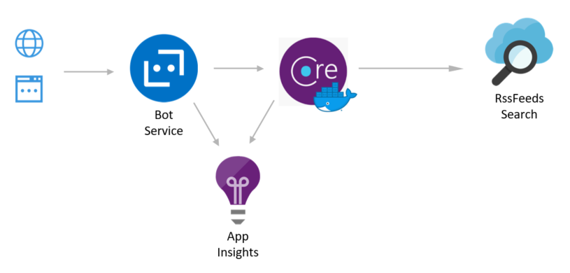

[](https://dev.azure.com/mabenoit-ms/MyOwnBacklog/_build/latest?definitionId=111&branchName=dotnetcore)

# MyMonthlyBlogArticle.Bot

This repository contains all the code and deployment setup related to this project: [My monthly "Azure News & Updates" blog article got a Bot!](https://alwaysupalwayson.blogspot.com/2018/04/my-monthly-azure-news-updates-blog.html).



# Prerequisities

First, you need to register your Bot Application in https://apps.dev.microsoft.com. From there, you should get 2 values for the deployment process below: `Application Id` and `Application Secret`.

_TIPS: you could put these values in [Azure Key Vault](https://docs.microsoft.com/en-us/azure/key-vault/key-vault-whatis) for more security and to be able to automate more. You could then [access the key/values pairs by modifying the ARM Template accordingly](https://docs.microsoft.com/en-us/azure/azure-resource-manager/resource-manager-keyvault-parameter)._

# Deploy

You could deploy this bot locally with VS Code or Visual Studio or even `dotnet` command line. Other ways explained below are to deploy it with `Docker` or `Helm`.

```
botName=<bot-name>
appId=<app-guid>
appSecret=<app-secret>
azureSearchServiceName=<azure-search-service-name>
azureSearchIndexName=<azure-search-index-name>
azureSearchServiceQueryApiKey=<azure-search-service-query-api-key>
appInsightsInstrumentationKey=<app-insights-instrumentation-key>
```

## Deploy with Docker

```
cd MyMonthlyBlogArticle.Bot/MyMonthlyBlogArticle.Bot/
docker build \
    -t $botName \
    '
#TODO: docker run -p 80:80 $botName
```

You could now expose your Docker image in a Container registry, with the command `docker push`.

## Deploy with Helm

As a prerequisities, you need to install `cert-manager`:
```
# Install cert-manager
kubectl apply -f https://raw.githubusercontent.com/jetstack/cert-manager/release-0.12/deploy/manifests/00-crds.yaml
kubectl create namespace cert-manager
kubectl label namespace cert-manager certmanager.k8s.io/disable-validation=true
helm repo add jetstack https://charts.jetstack.io
helm repo update
helm install \
    cert-manager \
    jetstack/cert-manager \
    -n cert-manager \
    --version v0.12.0
```

You could then run the `helm upgrade` command below against your Kuberentes cluster:

```
registryName=<registry-name>
k8sNamespace=<k8s-namespace-name>
dnsName=<custom-dns-name>
hostName=$dnsName.eastus.cloudapp.azure.com # could depend on your DNS, in my case that's the DNS on the Azure IP Address hosted in EastUS.

# Install MyMonthlyBlogArticle.Bot
cd MyMonthlyBlogArticle.Bot/chart
helm dependencies update
helm upgrade \
    --namespace $k8sNamespace \
    --install \
    --wait \
    --set image.repository=$registryName/$botName \
    --set image.env.microsoftAppId=$appId \
    --set image.env.microsoftAppPassword=$appPassword \
    --set image.env.appInsights.instrumentationKey=$appInsightsInstrumentationKey \
    --set image.env.search.serviceName=$azureSearchServiceName \
    --set image.env.search.indexName=$azureSearchIndexName \
    --set image.env.search.serviceQueryApiKey=$azureSearchServiceQueryApiKey \
    --set ingress.hostName=$hostName \
    --set nginx-ingress.defaultBackend.enabled=false \
    --set nginx-ingress.controller.image.tag=0.26.2 \
    --set nginx-ingress.controller.service.annotations[0]="service.beta.kubernetes.io/azure-dns-label-name: $hostName" \
    $botName \
    .

# We need to manually set the DNS on the Public IP generated by the Ingress Controller:
# There is currently a known issue (fixed by K8S 1.14.9, 1.15.7 and 1.16.0): https://github.com/kubernetes/kubernetes/issues/67813
ingressIpAddress=$(kubectl get service $botName-nginx-ingress-controller -o jsonpath="{.status.loadBalancer.ingress[*].ip}")
ingressAzurePublicIpId=$(az network public-ip list --query "[?ipAddress!=null]|[?contains(ipAddress, '$ingressIpAddress')].[id]" --output tsv)
az network public-ip update --ids $ingressAzurePublicIpId --dns-name $dnsName

# See all the objects deployed in the current Kubernetes namespace:
k get all,ing,secrets,cert,netpol,issuer

# From there you could now browse your public HTTPS endpoint:
curl $hostName
```

# Application Insights

Once the Azure Bot Service deployed you could leverage the Bot Analytics feature with Application Insights like described [here](https://docs.microsoft.com/azure/bot-service/bot-service-manage-analytics).

Additionally to that, you could perform different queries to retrieve information logged from the Bot Framework into Application Insights:

Get all the requests:
```
requests
| order by timestamp desc
```

Get all the search by month performed by the end users (because `telemetry.TrackEvent();` has been added in the code):
```
//all searches
customEvents
| order by timestamp desc 
| where name == "Search" or name == "Hello"

//count of items by type
customEvents
| where name == "Search" 
| summarize count() by tostring(customDimensions.SearchType)

//average of items returned by type
customEvents
| where name == "Search" 
| summarize avg(todouble(customDimensions.ResultCount)) by tostring(customDimensions.SearchType)

//count of search by query term
customEvents
| where name == "Search" 
| summarize count() by tostring(customDimensions.QueryTerms)

//TODO: leverage ElaspedTime + Most used SearchTerm
```
