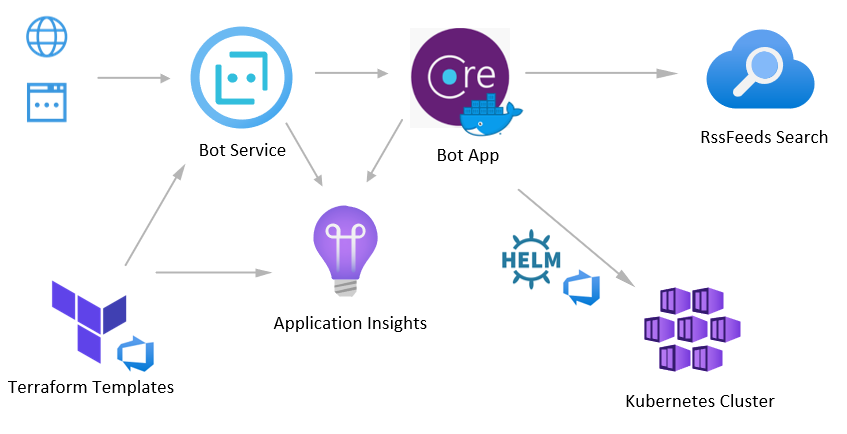

[](https://dev.azure.com/mabenoit-ms/MyOwnBacklog/_build/latest?definitionId=111&branchName=dotnetcore)

# MyMonthlyBlogArticle.Bot

This repository contains all the Bot Service and Azure Functions code and deployment setup related to this project: [My monthly "Azure News & Updates" blog article got a Bot!](https://alwaysupalwayson.blogspot.com/2018/04/my-monthly-azure-news-updates-blog.html).



# Prerequisities

You need to register first your Bot Application in https://apps.dev.microsoft.com. From there, you should get 2 values for the deployment process below: `Application Id` and `Application Secret`.

_TIPS: you could put these values in [Azure Key Vault](https://docs.microsoft.com/en-us/azure/key-vault/key-vault-whatis) for more security and to be able to automate more. You could then [access the key/values pairs by modifying the ARM Template accordingly](https://docs.microsoft.com/en-us/azure/azure-resource-manager/resource-manager-keyvault-parameter)._

# Deploy

## Deploy via the Azure portal

[](https://portal.azure.com/#create/Microsoft.Template/uri/https%3A%2F%2Fraw.githubusercontent.com%2Fmathieu-benoit%2FMyMonthlyBlogArticle.Bot%2Fmaster%2Fazure-deploy.json)

## Deploy via CLI

```
RG=<your-existing-resource-group-name>
BotName=<bot-name>
AppId=<app-guid>
AppSecret=<app-secret>
AzureSearchServiceName=<azure-search-service-name>
AzureSearchIndexName=<azure-search-index-name>
AzureSearchServiceQueryApiKey=<azure-search-service-query-api-key>

# Deployment for local file
az group deployment create \
  -g $RG \
  --template-file azure-deploy.json \
  --parameters botName=$BotName appSecret=$AppSecret appId=$AppId azureSearchServiceName=$AzureSearchServiceName azureSearchIndexName=$AzureSearchIndexName azureSearchServiceQueryApiKey=$AzureSearchServiceQueryApiKey
  
# Deployment for remote file
az group deployment create \
  -g $RG \
  --template-uri https://raw.githubusercontent.com/mathieu-benoit/MyMonthlyBlogArticle.Bot/master/azure-deploy.json \
  --parameters botName=$BotName appSecret=$AppSecret appId=$AppId azureSearchServiceName=$AzureSearchServiceName azureSearchIndexName=$AzureSearchIndexName azureSearchServiceQueryApiKey=$AzureSearchServiceQueryApiKey
```

# Application Insights

Once the Azure Bot Service deployed you could leverage the Bot Analytics feature with Application Insights like described [here](https://docs.microsoft.com/en-us/azure/bot-service/bot-service-manage-analytics).

Additionally to that, you could perform different queries to retrieve information logged from the Azure Functions into Application Insights:

Get all the requests performed on the Azure Functions (because `APPINSIGHTS_INSTRUMENTATIONKEY` has been added on Azure Functions App's App Settings):
```
requests
| order by timestamp desc
```

Get all the search by month performed by the end users (because `telemetry.TrackEvent();` has been added in the code):
```
//all searches
customEvents
| order by timestamp desc 
| where name == "Search" or name == "Hello"

//count of items by type
customEvents
| where name == "Search" 
| summarize count() by tostring(customDimensions.SearchType)

//average of items returned by type
customEvents
| where name == "Search" 
| summarize avg(todouble(customDimensions.ResultCount)) by tostring(customDimensions.SearchType)

//count of search by query term
customEvents
| where name == "Search" 
| summarize count() by tostring(customDimensions.QueryTerms)

//TODO: leverage ElaspedTime + Most used SearchTerm
```
